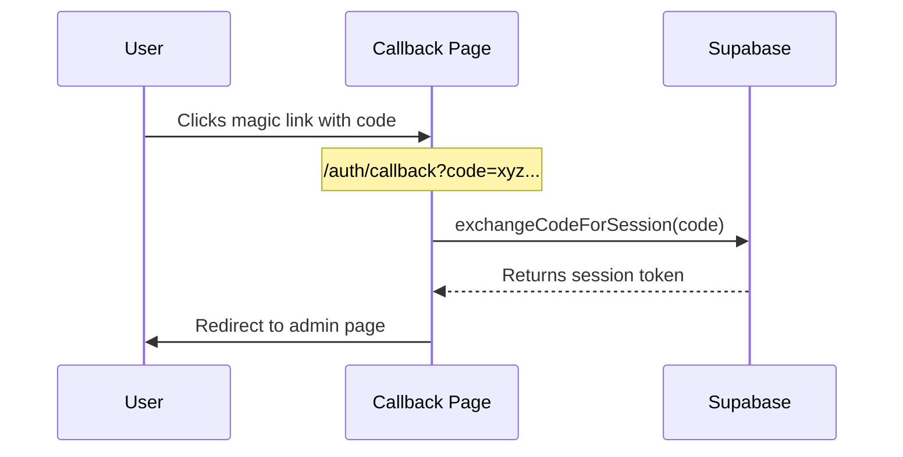
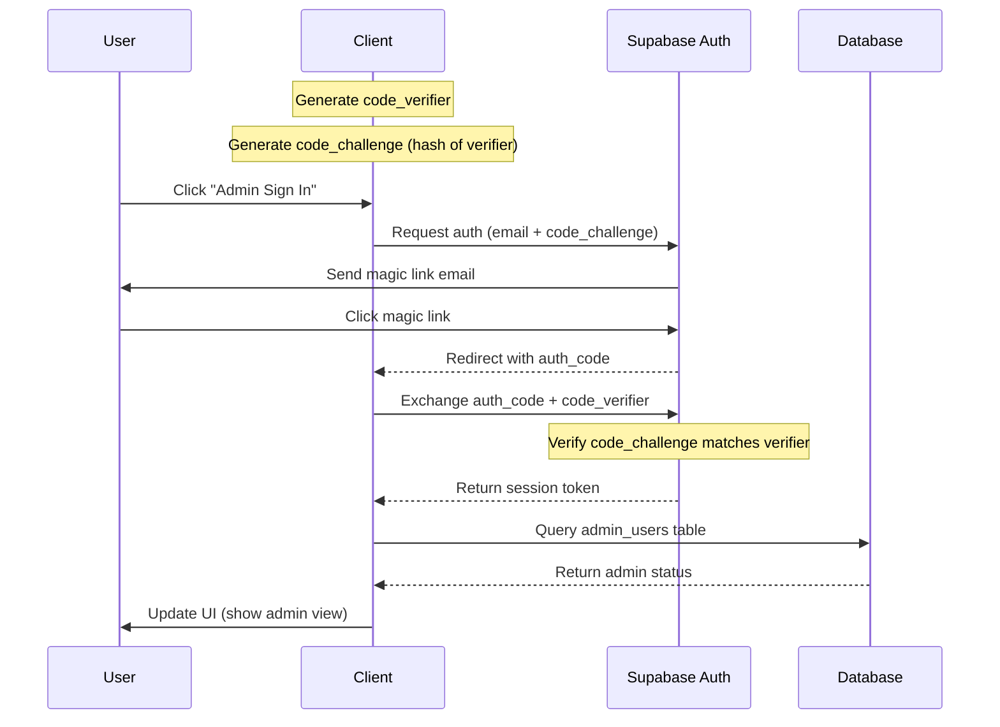

# Chizubo's Essays and Research

A personal website inspired by gwern.net, built with Astro and Tailwind CSS.

## 📁 Project Structure

```text
/
├── public/                  # Static assets (robots.txt, favicon, etc. no processing or bundling here)
│   ├── *.svg
├── scripts/                 # Utility and automation scripts
│   └── algolia-index.mjs
├── src/
│   ├── assets/              # Images and other asset files (bundled and optimized, useful for images, fonts etc.)
│   ├── components/          # Reusable UI components
│   ├── contexts/            # React/JS context providers
│   ├── layouts/             # Page layout templates
│   ├── pages/               # Route definitions (Astro/MD/MDX)
│   ├── styles/              # CSS styles (global, theme, component)
│   └── utils/               # Utility functions and plugins
├── supabase/                # Supabase SQL and RLS policy files
│   ├── auth-policies.sql
│   └── supabase-schema.sql
├── .github/                 # GitHub configuration
│   └── workflows/
│       └── deploy.yml
├── .vscode/                 # VSCode workspace settings
│   ├── extensions.json
│   └── launch.json
├── package.json
├── astro.config.mjs
├── tailwind.config.mjs
├── tsconfig.json
└── README.md
```

## Commands

All commands are run from the root of the project, from a terminal.

### Standard Development

These commands are used for typical local development with Astro's built-in server.

| Command           | Action                                      |
| :---------------- | :------------------------------------------ |
| `npm install`     | Installs dependencies                       |
| `npm run dev`     | Starts local dev server at `localhost:4321` |
| `npm run build`   | Build your production site to `./dist/`     |
| `npm run preview` | Preview your production build locally       |

### Vercel Development

Since this site is deployed on Vercel, you can use the Vercel CLI to closely emulate the production
environment on your local machine.

| Command           | Action                                      |
| :---------------- | :------------------------------------------ |
| `npm i -g vercel` | Installs the Vercel CLI globally (one-time) |
| `vercel dev`      | Starts a local server emulating Vercel      |
| `vercel link`     | Links your local repo to a Vercel project   |
| `vercel deploy`   | Deploys the current version to preview      |
| `vercel --prod`   | Deploys the current version to production   |

## Styling Guidelines

The project follows these styling principles:

- **Component-specific styles**: Keep in component file
- **Shared styles and patterns**: Place in `/styles` directory
- **Global styles and CSS variables**: Use `/styles/theme.css` or `/styles/global.css`
- **Light/Dark Mode**: Implemented using CSS variables and Tailwind's dark mode

## Authentication Flow

The site uses Supabase for authentication, implementing a secure PKCE (Proof Key for Code Exchange)
flow with magic links. This provides a passwordless authentication system for admin access.

### Magic Link Authentication Flow

The first diagram shows the high-level magic link authentication flow:



### Detailed PKCE Flow

The second diagram shows the detailed PKCE flow with magic links:



This implementation ensures:

- Secure passwordless authentication
- Protection against CSRF attacks
- Verification of admin status
- Session management with secure tokens

## To-Do

- [x] Add search functionality
- [x] Add essay indexing
- [x] Improve page styling with nested directional links
- [x] Add toggle drop down
- [ ] Add recommendation
- [x] Add comments
- [x] Properly secure admin interface
- [ ] Add rss feed
- [x] Optimize for mobile screen
- [ ] Change UI admin
- [ ] Add Dropcaps (?)
- [ ] Get Domain Name

## Credits

- Icons from [SVG Silh](https://svgsilh.com/)
