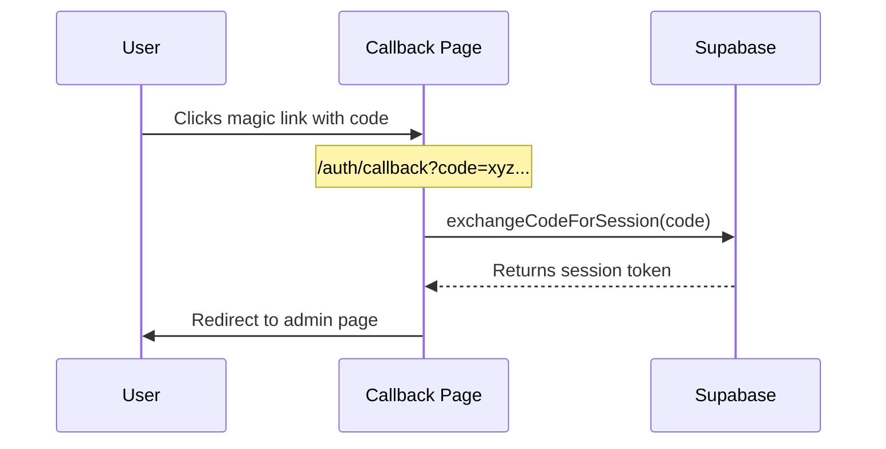
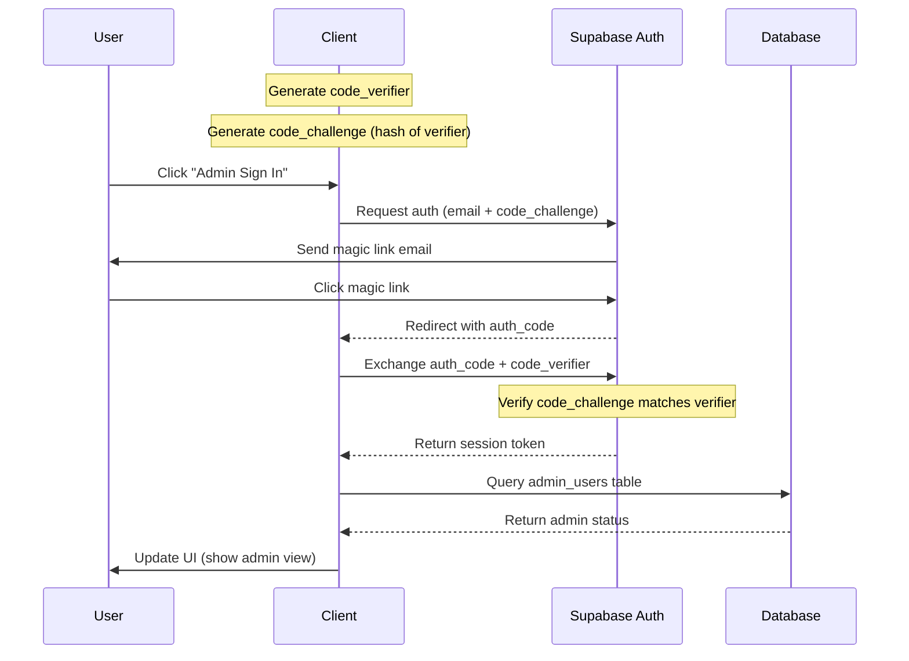
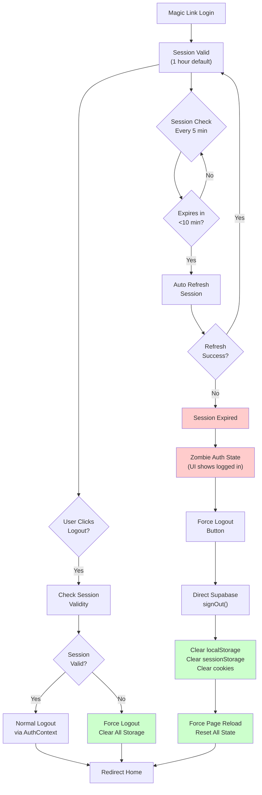
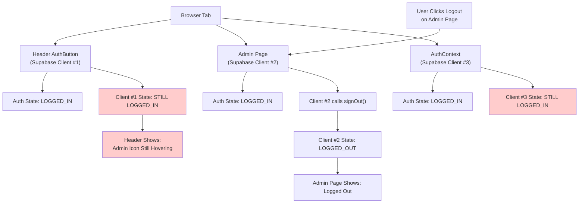
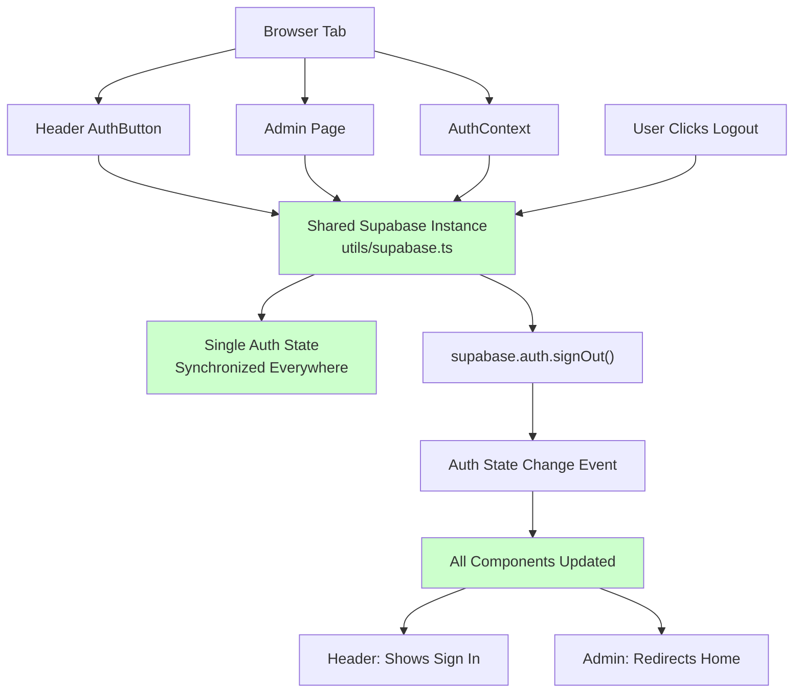

# BBB's Essays and Research

A personal website inspired by gwern.net, built with Astro and Tailwind CSS.

## Project Structure

```text
/
├── public/                  # Static assets (robots.txt, favicon, etc. no processing or bundling here)
│   ├── *.svg
├── scripts/                 # Utility and automation scripts
│   └── algolia-index.mjs
├── src/
│   ├── assets/              # Images and other asset files (bundled and optimized, useful for images, fonts etc.)
│   ├── components/          # Reusable UI components
│   ├── contexts/            # React/JS context providers
│   ├── layouts/             # Page layout templates
│   ├── pages/               # Route definitions (Astro/MD/MDX)
│   ├── styles/              # CSS styles (global, theme, component)
│   └── utils/               # Utility functions and plugins
├── supabase/                # Supabase SQL and RLS policy files
│   ├── auth-policies.sql
│   └── supabase-schema.sql
├── .github/                 # GitHub configuration
│   └── workflows/
│       └── deploy.yml
├── .vscode/                 # VSCode workspace settings
│   ├── extensions.json
│   └── launch.json
├── package.json
├── astro.config.mjs
├── tailwind.config.mjs
├── tsconfig.json
└── README.md
```

## Commands

All commands are run from the root of the project, from a terminal.

### Standard Development

These commands are used for typical local development with Astro's built-in server.

| Command           | Action                                      |
| :---------------- | :------------------------------------------ |
| `npm install`     | Installs dependencies                       |
| `npm run dev`     | Starts local dev server at `localhost:4321` |
| `npm run build`   | Build your production site to `./dist/`     |
| `npm run preview` | Preview your production build locally       |

### Vercel Development

Since this site is deployed on Vercel, you can use the Vercel CLI to closely emulate the production
environment on your local machine.

| Command           | Action                                      |
| :---------------- | :------------------------------------------ |
| `npm i -g vercel` | Installs the Vercel CLI globally (one-time) |
| `vercel dev`      | Starts a local server emulating Vercel      |
| `vercel link`     | Links your local repo to a Vercel project   |
| `vercel deploy`   | Deploys the current version to preview      |
| `vercel --prod`   | Deploys the current version to production   |

## Styling Guidelines

The project follows these styling principles:

- **Component-specific styles**: Keep in component file
- **Shared styles and patterns**: Place in `/styles` directory
- **Global styles and CSS variables**: Use `/styles/theme.css` or `/styles/global.css`
- **Light/Dark Mode**: Implemented using CSS variables and Tailwind's dark mode

## Creating New Essays

When you create a new essay, the following workflow ensures it's properly integrated into your site:

### 1. Create the Markdown File

Create a new `.md` file in `src/pages/essays/` with the following frontmatter structure:

```markdown
---
layout: ../../layouts/EssayLayout.astro
title: 'Your Essay Title'
description: 'A brief description of your essay'
dateCreated: 'YYYY-MM-DD'
dateUpdated: 'YYYY-MM-DD'
confidence: 'likely', or 'uncertain', 'unlikely', 'NA'
category: 'Computation' # Choose from available categories
importance: '4' # Scale of 1-5
tags:
  - tag1
  - tag2
  - tag3
---

## Your Essay Content

Your markdown content goes here...
```

### 2. Available Categories

Choose from these predefined categories (defined in `src/utils/constants.ts`):

- Astrophysics
- Biophysics
- Biosecurity
- Cellular & Molecular Biology
- Chemistry
- Computation
- Ecology
- Geophysics & Climate
- Immunology
- Materials Science
- Mechanical Engineering
- Metascience
- Nanoscale Fabrication
- Neuroscience
- Physics
- Physiology & Medicine
- Social Science
- Space Engineering
- Synthetic Biology
- Philosophy

### 3. What Happens Automatically

When you create a new essay:

1. **Build Process**: The essay is automatically included in the build when you run `npm run build`
2. **Reading Metrics**: Word count and reading time are calculated automatically
3. **Search Indexing**: The essay is indexed in Algolia for search functionality
4. **Essays List**: The essay appears on `/essays` with proper sorting by date
5. **Homepage**: The essay appears on the homepage categorized by topic
6. **Comments**: The essay gets a comments section powered by Supabase
7. **SEO**: Proper meta tags and Open Graph data are generated

### 4. Automated Deployment

The deployment process is fully automated:

1. **Search Indexing**: Runs automatically during `npm run build` (which Vercel executes)
2. **Deployment**: Push to GitHub to trigger Vercel deployment
3. **Verification**: Check that your essay appears correctly on your site

#### Manual Commands (if needed)

- `npm run index-search` - Manually update search index
- `npm run build:no-index` - Build without search indexing (for testing)
- `npm run build` - Full build with search indexing

### 5. File Naming Convention

Use kebab-case for filenames (e.g., `my-essay-title.md`). The filename becomes the URL slug.

## Authentication Flow

The site uses Supabase for authentication, implementing a secure PKCE (Proof Key for Code Exchange)
flow with magic links. This provides a passwordless authentication system for admin access.

### Magic Link Authentication Flow

The first diagram shows the high-level magic link authentication flow:



### Detailed PKCE Flow

The second diagram shows the detailed PKCE flow with magic links:



### Magic Link Expiry & Zombie Auth Prevention

Magic links expire after 1 hour by default, which can cause "zombie auth" states where the UI shows
logged in but the session is invalid. Our implementation handles this with multiple layers:



**Prevention Strategies:**

1. **Auto Session Refresh** - Check every 5 minutes, refresh if <10 minutes remain
2. **Session Validity Checks** - Verify session before logout attempts
3. **Force Logout Capability** - Nuclear option that always works
4. **Shared Supabase Instance** - Single auth state across all components
5. **Complete State Reset** - Clear all storage + force page reload

This implementation ensures:

- Secure passwordless authentication
- Protection against CSRF attacks
- Verification of admin status
- Session management with secure tokens
- **Robust handling of session expiry**
- **Prevention of zombie auth states**

## Common Authentication Anti-patterns & Lessons Learned

### The Multiple Supabase Clients Problem

**What I Did Wrong:**

During development, I accidentally created **multiple Supabase client instances** across different
components:

```javascript
// BAD: Multiple instances
// In admin page script:
const supabase1 = createClient(url, key);

// In AuthButtonWrapper:
const supabase2 = createClient(url, key);

// In AuthContext:
const supabase3 = createClient(url, key);
```

### The Problem Chain



**Symptoms:**

- Logout button appears to work but header still shows "admin hovering state"
- Console warning: "Multiple GoTrueClient instances detected"
- Inconsistent authentication state across components
- Users stuck in "zombie auth" state

### Solution: Shared Singleton Pattern

**Create one shared Supabase instance in `utils/supabase.ts`:**

```javascript
// GOOD: Single shared instance
import { createClient } from '@supabase/supabase-js';

export const supabase = createClient(url, key, {
  auth: {
    autoRefreshToken: true,
    persistSession: true,
    detectSessionInUrl: true,
    flowType: 'pkce',
  },
});
```

**Import the same instance everywhere:**

```javascript
// All components use the SAME instance
import { supabase } from '../utils/supabase';
```

### Fixed Architecture



### Lessons

1. **Singleton Pattern**: Always use a single Supabase client instance
2. **Centralized State**: Authentication state should be managed in one place
3. **Event Propagation**: Auth state changes must propagate to all components
4. **Console Warnings**: Pay attention to "Multiple GoTrueClient instances" warnings
5. **Testing Logout**: Always test logout from different UI components

### Detecting This Problem

- **Console Warning**: `Multiple GoTrueClient instances detected`
- **Inconsistent UI**: Some components show logged in, others show logged out
- **Failed Logout**: Logout works in some places but not others
- **Zombie States**: User appears logged in but API calls fail

### Prevention

- **Use a shared utility file** for Supabase client
- **Import the same instance** in all components
- **Avoid creating clients in component files**
- **Use proper React Context** for auth state management
- **Test authentication flows** across all UI components

## Credits

- Icons from [SVG Silh](https://svgsilh.com/)
