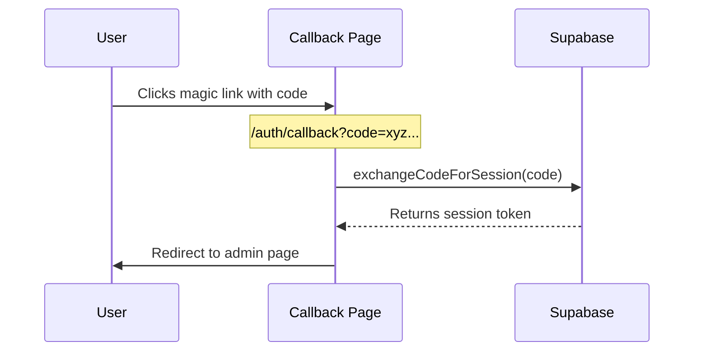
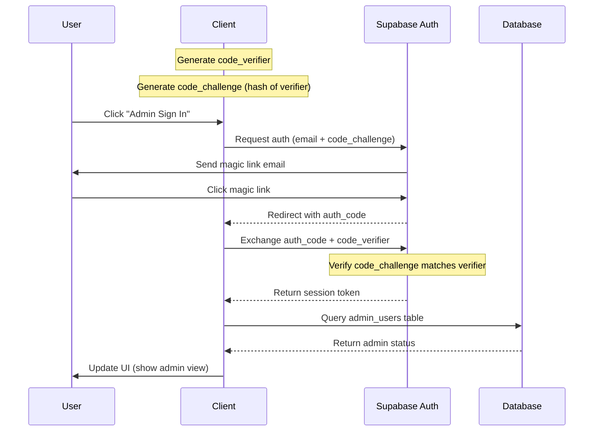
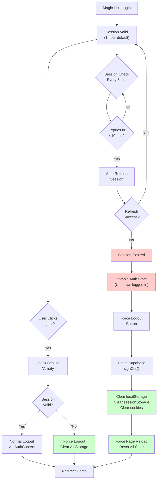
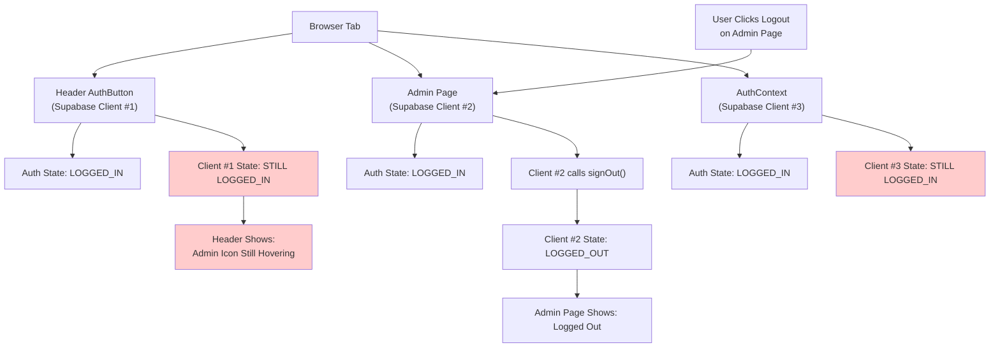
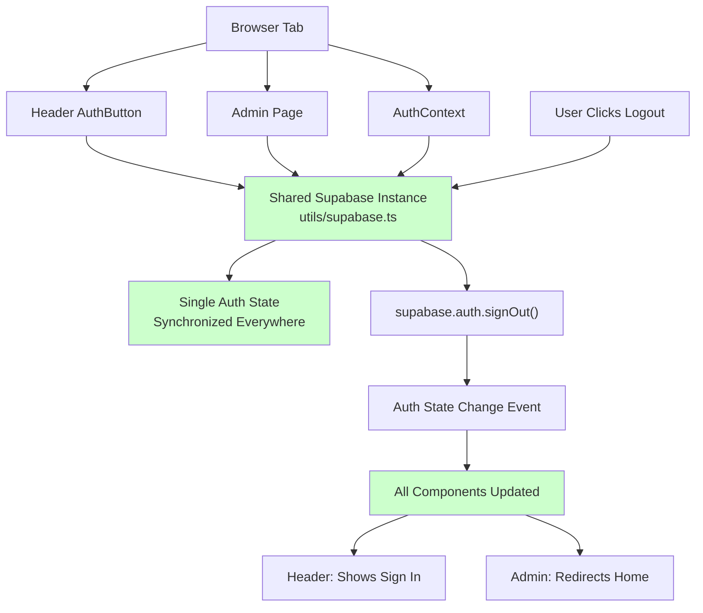

# BBB's Essays and Research

A personal website inspired by gwern.net, built with Astro and Tailwind CSS.

## Project Structure

```text
/
├── public/                  # Static assets (robots.txt, favicon, etc. no processing or bundling here)
│   ├── *.svg
├── scripts/                 # Utility and automation scripts
│   └── algolia-index.mjs
├── src/
│   ├── assets/              # Images and other asset files (bundled and optimized, useful for images, fonts etc.)
│   ├── components/          # Reusable UI components
│   ├── contexts/            # React/JS context providers
│   ├── layouts/             # Page layout templates
│   ├── pages/               # Route definitions (Astro/MD/MDX)
│   ├── styles/              # CSS styles (global, theme, component)
│   └── utils/               # Utility functions and plugins
├── supabase/                # Supabase SQL and RLS policy files
│   ├── auth-policies.sql
│   └── supabase-schema.sql
├── .github/                 # GitHub configuration
│   └── workflows/
│       └── deploy.yml
├── .vscode/                 # VSCode workspace settings
│   ├── extensions.json
│   └── launch.json
├── package.json
├── astro.config.mjs
├── tailwind.config.mjs
├── tsconfig.json
└── README.md
```

## Commands

All commands are run from the root of the project, from a terminal.

### Standard Development

| Command           | Status | Action                                      |
| :---------------- | :----- | :------------------------------------------ |
| `npm install`     | ✅     | Installs dependencies                       |
| `npm run dev`     | ✅     | Starts local dev server at `localhost:4321` |
| `npm run build`   | ✅     | Build your production site to `./dist/`     |
| `npm run preview` | ❌     | **Does not work** with Vercel adapter       |

**Note:** `npm run preview` is not supported when using the `@astrojs/vercel` adapter. Use
`vercel dev` instead (see below).

### Vercel Development

Since this site is deployed on Vercel and uses the Vercel adapter, use these commands to test your
production build locally:

| Command           | Action                                      |
| :---------------- | :------------------------------------------ |
| `npm i -g vercel` | Installs the Vercel CLI globally (one-time) |
| `vercel dev`      | Starts a local server emulating Vercel      |
| `vercel link`     | Links your local repo to a Vercel project   |
| `vercel deploy`   | Deploys the current version to preview      |
| `vercel --prod`   | Deploys the current version to production   |

### When to Use Which Command

#### `npm run dev` vs `npm run build`

**Use `npm run dev` when:**

- **Writing/editing code** - Fast hot-reload, instant feedback on changes
- **Debugging** - Source maps and unminified code for easier debugging
- **Rapid iteration** - See changes immediately without rebuilding
- **Development only** - Not optimized for production

**Use `npm run build` when:**

- **Before deploying** - Verify your site builds without errors
- **Testing production output** - Check that optimizations work correctly
- **CI/CD pipelines** - Automated builds (Vercel runs this automatically)
- **Performance testing** - Test with minified, optimized code
- **Catching build-time errors** - Find issues that only appear in production builds

**Key Differences:**

| Feature      | `npm run dev`   | `npm run build`     |
| ------------ | --------------- | ------------------- |
| Speed        | Fast startup    | Slower (full build) |
| Optimization | None (dev mode) | Minified, optimized |
| Hot Reload   | ✅ Yes          | ❌ No               |
| Output       | In-memory       | `./dist/` folder    |
| Use Case     | Development     | Production          |

#### Complete Workflow

**For day-to-day development:**

- Use `npm run dev` - Fast hot-reload, instant feedback on changes

**Before deploying/testing production build:**

- Use `npm run build` - Ensures your site builds successfully
- Use `vercel dev` - Test the production build locally with Vercel environment

**For deployment:**

- Push to GitHub - Automatic deployment via Vercel integration (recommended)
- Use `vercel deploy` - Manual preview deployment for testing
- Use `vercel --prod` - Manual production deployment (use with caution)

## Styling Guidelines

The project follows these styling principles:

- **Component-specific styles**: Keep in component file
- **Shared styles and patterns**: Place in `/styles` directory
- **Global styles and CSS variables**: Use `/styles/theme.css` or `/styles/global.css`
- **Light/Dark Mode**: Implemented using CSS variables and Tailwind's dark mode

## Creating New Essays

When you create a new essay, the following workflow ensures it's properly integrated into your site:

### 1. Create the Markdown File

Create a new `.md` file in `src/pages/essays/` with the following frontmatter structure:

```markdown
---
layout: ../../layouts/EssayLayout.astro
title: 'Your Essay Title'
description: 'A brief description of your essay'
dateCreated: 'YYYY-MM-DD'
dateUpdated: 'YYYY-MM-DD'
confidence: 'likely', or 'uncertain', 'unlikely', 'NA'
category: 'Computation' # Choose from available categories
importance: '4' # Scale of 1-5
tags:
  - tag1
  - tag2
  - tag3
---

## Your Essay Content

Your markdown content goes here...
```

### 2. Available Categories

Choose from these predefined categories (defined in `src/utils/constants.ts`):

- Astrophysics
- Biophysics
- Biosecurity
- Cellular & Molecular Biology
- Chemistry
- Computation
- Ecology
- Geophysics & Climate
- Immunology
- Materials Science
- Mechanical Engineering
- Metascience
- Nanoscale Fabrication
- Neuroscience
- Physics
- Physiology & Medicine
- Social Science
- Space Engineering
- Synthetic Biology
- Philosophy

### 3. What Happens Automatically

When you create a new essay:

1. **Build Process**: The essay is automatically included in the build when you run `npm run build`
2. **Reading Metrics**: Word count and reading time are calculated automatically
3. **Search Indexing**: The essay is indexed in Algolia for search functionality
4. **Essays List**: The essay appears on `/essays` with proper sorting by date
5. **Homepage**: The essay appears on the homepage categorized by topic
6. **Comments**: The essay gets a comments section powered by Supabase
7. **SEO**: Proper meta tags and Open Graph data are generated

### 4. Automated Deployment

The deployment process is fully automated:

1. **Search Indexing**: Runs automatically during `npm run build` (which Vercel executes)
2. **Deployment**: Push to GitHub to trigger Vercel deployment
3. **Verification**: Check that your essay appears correctly on your site

#### Manual Commands (if needed)

- `npm run index-search` - Manually update search index
- `npm run build:no-index` - Build without search indexing (for testing)
- `npm run build` - Full build with search indexing

### 5. File Naming Convention

Use kebab-case for filenames (e.g., `my-essay-title.md`). The filename becomes the URL slug.

## Authentication Flow

The site uses Supabase for authentication, implementing a secure PKCE (Proof Key for Code Exchange)
flow with magic links. This provides a passwordless authentication system for admin access.

### Magic Link Authentication Flow

The first diagram shows the high-level magic link authentication flow:


```mermaid
sequenceDiagram
    participant User
    participant Callback Page
    participant Supabase

    User->>Callback Page: Clicks magic link with code
    Note over Callback Page: /auth/callback?code=xyz...
    Callback Page->>Supabase: exchangeCodeForSession(code)
    Supabase-->>Callback Page: Returns session token
    Callback Page->>User: Redirect to admin page
```

### Detailed PKCE Flow

The second diagram shows the detailed PKCE flow with magic links:


```mermaid
sequenceDiagram
    participant User
    participant Client
    participant Supabase Auth
    participant Database

    Note over Client: Generate code_verifier
    Note over Client: Generate code_challenge (hash of verifier)
    User->>Client: Click "Admin Sign In"
    Client->>Supabase Auth: Request auth (email + code_challenge)
    Supabase Auth->>User: Send magic link email
    User->>Supabase Auth: Click magic link
    Supabase Auth-->>Client: Redirect with auth_code
    Client->>Supabase Auth: Exchange auth_code + code_verifier
    Note over Supabase Auth: Verify code_challenge matches verifier
    Supabase Auth-->>Client: Return session token
    Client->>Database: Query admin_users table
    Database-->>Client: Return admin status
    Client->>User: Update UI (show admin view)
```

### Magic Link Expiry & Zombie Auth Prevention

Magic links expire after 1 hour by default, which can cause "zombie auth" states where the UI shows
logged in but the session is invalid. Our implementation handles this with multiple layers:


```mermaid
graph TD
    A["Magic Link Login"] --> B["Session Valid<br/>(1 hour default)"]
    B --> C{"Session Check<br/>Every 5 min"}
    C --> D{"Expires in<br/><10 min?"}
    D -->|Yes| E["Auto Refresh<br/>Session"]
    D -->|No| C
    E --> F{"Refresh<br/>Success?"}
    F -->|Yes| B
    F -->|No| G["Session Expired"]
    B --> H{"User Clicks<br/>Logout?"}
    H -->|Yes| I["Check Session<br/>Validity"]
    I --> J{"Session<br/>Valid?"}
    J -->|Yes| K["Normal Logout<br/>via AuthContext"]
    J -->|No| L["Force Logout<br/>Clear All Storage"]
    G --> M["Zombie Auth State<br/>(UI shows logged in)"]
    M --> N["Force Logout<br/>Button"]
    N --> O["Direct Supabase<br/>signOut()"]
    O --> P["Clear localStorage<br/>Clear sessionStorage<br/>Clear cookies"]
    P --> Q["Force Page Reload<br/>Reset All State"]
    K --> R["Redirect Home"]
    L --> R
    Q --> R

    style G fill:#ffcccc
    style M fill:#ffcccc
    style L fill:#ccffcc
    style P fill:#ccffcc
    style Q fill:#ccffcc
```

**Prevention Strategies:**

1. **Auto Session Refresh** - Check every 5 minutes, refresh if <10 minutes remain
2. **Session Validity Checks** - Verify session before logout attempts
3. **Force Logout Capability** - Nuclear option that always works
4. **Shared Supabase Instance** - Single auth state across all components
5. **Complete State Reset** - Clear all storage + force page reload

This implementation ensures:

- Secure passwordless authentication
- Protection against CSRF attacks
- Verification of admin status
- Session management with secure tokens
- **Robust handling of session expiry**
- **Prevention of zombie auth states**

## Authentication Architecture & Lessons Learned

### Centralized Auth Helpers Pattern

The authentication system uses a **three-layer architecture** for maintainability and reliability:

```
auth-helpers.ts (Core utilities)
      ↓
callback.astro + AuthContext.tsx (Integration layer)
      ↓
Admin pages + React components (UI layer)
```

**Key Components:**

1. **`auth-helpers.ts`** - Single source of truth for auth operations

   - `getValidSession()` - Session retrieval with timeout protection (5s default)
   - `completeSignOut()` - Thorough cleanup of all auth state
   - `isSessionValid()` - Expiration check with 30s buffer

2. **`callback.astro`** - Magic link handler with timeout protection

3. **`AuthContext.tsx`** - React auth state provider

4. **Admin pages** - Use `auth-helpers.ts` directly with 1-hour periodic validation

### Critical Lessons: Navigation Hangs & Timeouts

**Problem:** Client-side `supabase.auth.getSession()` could hang indefinitely during page
navigation, especially when auth state listeners from the previous page conflicted.

**Solution:** Wrap all session checks with `Promise.race()` and timeout:

```typescript
// ✅ GOOD: With timeout protection
const session = await getValidSession(5000); // 5 second timeout

// ❌ BAD: No timeout
const {
  data: { session },
} = await supabase.auth.getSession();
```

**Why This Matters:**

- Supabase client persists across page navigations
- Multiple auth state listeners can cause deadlocks
- Without timeout, users see "Getting session..." forever
- With timeout: max 6 seconds (5s wait + 1s retry) vs infinite hang

### Critical Lessons: Session Expiration Detection

**Problem:** Sessions expire after 1 hour but pages only checked if session _existed_, not if it was
_expired_. This caused silent failures for comments and analytics.

**Solution:** Check expiration with buffer and auto-refresh:

```typescript
// Check if session is still valid (30s buffer)
if (!isSessionValid(session)) {
  // Attempt to refresh
  const refreshed = await supabase.auth.refreshSession();
  return refreshed.session;
}
```

**Implementation:**

- Admin pages validate every 1 hour (was 2 minutes)
- AuthContext validates every 5 minutes
- Auto-refresh if < 10 minutes remain
- Clear error messages when expired

### Critical Lessons: Incomplete Sign Out

**Problem:** `supabase.auth.signOut()` only cleared Supabase's internal state. Users could still
access `/admin` by typing the URL directly after signing out.

**Solution:** Comprehensive cleanup that clears ALL storage:

```typescript
// ✅ GOOD: Complete sign out
await completeSignOut(); // Clears Supabase + localStorage + sessionStorage + cookies

// ❌ BAD: Incomplete
await supabase.auth.signOut(); // Only clears Supabase internal state
```

### The Multiple Supabase Clients Problem

**What I Did Wrong:**

During development, I accidentally created **multiple Supabase client instances** across different
components:

```javascript
// BAD: Multiple instances
// In admin page script:
const supabase1 = createClient(url, key);

// In AuthButtonWrapper:
const supabase2 = createClient(url, key);

// In AuthContext:
const supabase3 = createClient(url, key);
```

### The Problem Chain


```mermaid
graph TD
    A["Browser Tab"] --> B["Header AuthButton<br/>(Supabase Client #1)"]
    A --> C["Admin Page<br/>(Supabase Client #2)"]
    A --> D["AuthContext<br/>(Supabase Client #3)"]

    B --> E["Auth State: LOGGED_IN"]
    C --> F["Auth State: LOGGED_IN"]
    D --> G["Auth State: LOGGED_IN"]

    H["User Clicks Logout<br/>on Admin Page"] --> C
    C --> I["Client #2 calls signOut()"]
    I --> J["Client #2 State: LOGGED_OUT"]

    B --> K["Client #1 State: STILL LOGGED_IN"]
    D --> L["Client #3 State: STILL LOGGED_IN"]

    K --> M["Header Shows:<br/>Admin Icon Still Hovering"]
    J --> N["Admin Page Shows: Logged Out"]

    style K fill:#ffcccc
    style L fill:#ffcccc
    style M fill:#ffcccc
```

**Symptoms:**

- Logout button appears to work but header still shows "admin hovering state"
- Console warning: "Multiple GoTrueClient instances detected"
- Inconsistent authentication state across components
- Users stuck in "zombie auth" state

### Solution: Shared Singleton Pattern

**Create one shared Supabase instance in `utils/supabase.ts`:**

```javascript
// GOOD: Single shared instance
import { createClient } from '@supabase/supabase-js';

export const supabase = createClient(url, key, {
  auth: {
    autoRefreshToken: true,
    persistSession: true,
    detectSessionInUrl: true,
    flowType: 'pkce',
  },
});
```

**Import the same instance everywhere:**

```javascript
// All components use the SAME instance
import { supabase } from '../utils/supabase';
```

### Fixed Architecture


```mermaid
graph TD
    A["Browser Tab"] --> B["Header AuthButton"]
    A --> C["Admin Page"]
    A --> D["AuthContext"]

    B --> E["Shared Supabase Instance<br/>utils/supabase.ts"]
    C --> E
    D --> E

    E --> F["Single Auth State<br/>Synchronized Everywhere"]

    G["User Clicks Logout"] --> E
    E --> H["supabase.auth.signOut()"]
    H --> I["Auth State Change Event"]
    I --> J["All Components Updated"]
    J --> K["Header: Shows Sign In"]
    J --> L["Admin: Redirects Home"]

    style E fill:#ccffcc
    style F fill:#ccffcc
    style J fill:#ccffcc
```

### Lessons

1. **Singleton Pattern**: Always use a single Supabase client instance
2. **Centralized State**: Authentication state should be managed in one place
3. **Event Propagation**: Auth state changes must propagate to all components
4. **Console Warnings**: Pay attention to "Multiple GoTrueClient instances" warnings
5. **Testing Logout**: Always test logout from different UI components

### Detecting This Problem

- **Console Warning**: `Multiple GoTrueClient instances detected`
- **Inconsistent UI**: Some components show logged in, others show logged out
- **Failed Logout**: Logout works in some places but not others
- **Zombie States**: User appears logged in but API calls fail

### Prevention

- **Use a shared utility file** for Supabase client
- **Import the same instance** in all components
- **Avoid creating clients in component files**
- **Use proper React Context** for auth state management
- **Test authentication flows** across all UI components

---

### Security Considerations

**Current Implementation:** Client-side JavaScript checks

**Limitations:**

- Can be bypassed if JavaScript is disabled
- Pages load before auth checks complete

**Future Improvements:**

1. **Server-side protection** - Add Astro middleware for `/admin/*` routes
2. **Cookie-based sessions** - Enable server-side session access
3. **Multi-factor authentication** - Additional security layer for admin access

**For comprehensive troubleshooting, see:** `/docs/ADMIN_AUTH_COMPLETE_GUIDE.md`

**For future improvements, see:** `/plans/auth-improvements/`

---

## Credits

- Icons from [SVG Silh](https://svgsilh.com/)
